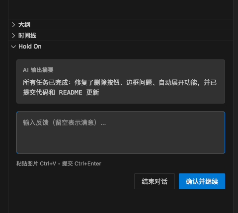

# Hold On Plugin

让 AI 停下来听你说话 - IDE 内嵌反馈面板

## 功能

- 💬 **内嵌面板** - 在 IDE 底部面板显示，不打断编码流程
- 🖼️ **图片支持** - 粘贴图片反馈
- ⚡ **快捷键** - Ctrl+Enter 提交，Esc 结束对话
- 🔌 **MCP 协议** - 标准 Model Context Protocol 支持



## 安装

1. 下载 .vsix 文件
2. VS Code/Windsurf: `Cmd+Shift+P` → `Extensions: Install from VSIX...`

## 配置 MCP

1. `Cmd+Shift+P` → `Hold On: Copy MCP Config`
2. 粘贴到 MCP 配置文件

## 使用

在 AI 规则中添加：

```
**强制交互协议：**
1. 你现在拥有 `request_approval` 工具。
2. **每次输出后必须调用 `request_approval` 确认**。
3. 如果用户给了调整指令，必须在当前对话中立即修改。
4. 用户留空点确认 = 满意；用户输入内容 = 需要调整。
5. 如果返回"用户结束对话"，则停止调用 `request_approval`。
```

## 开发

```bash
npm install
npm run compile
```

## License

MIT
